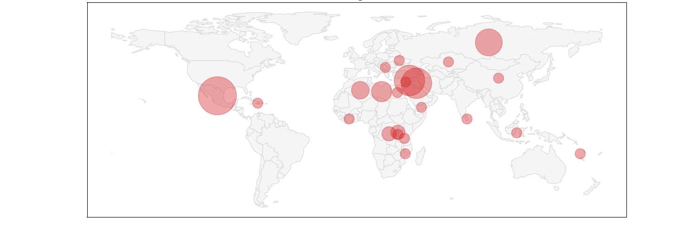

<h1 align="center">An Introduction to GeoPandas:</h1>
<h3 align="center">Missing Journalists World-Wide in 2021</h3>

<div align="center">
  
</div>

## Description

This project was initially a class assignment intended to introduce the GeoPandas library. While searching for data with spatial attributes that I could use to demonstrate the library, I thought of the Committee to Protect Journalists. The CPJ keeps a tally of some grim statistics - attacks on journalists around the world. On their site, you can view counts by year, or country, of journalists killed, detained, or simply missing.

>_I feel it's only appropriate, before getting into the details of the project, to acknowledge the sacrifices of the many dedicated journalists around the world who refuse to be intimidated or corrupted by autocratic or military regimes, or by criminal organizations._

Finally, in addition to GeoPandas, the notebook was intended to demonstrate choropleth maps. GeoPandas can show them easily for a single variable, but doesn't have a natural way to show bivariate choropleth maps. I show a couple of crude workarounds, but for multiple variables, another library would be more appropriate.

#### Contents

1- Visualization Library: GeoPandas</br>
2- Demonstration</br>
3- Visualization Technique: Choropleth Maps</br>

## Getting Started

#### Dependencies

The only library needed is GeoPandas.
```
pip install geopandas
```

You can find more information on GeoPandas here:
https://geopandas.org/en/stable/getting_started/introduction.html

#### Data

The notebook uses two datasets:

* The CPJ data on journalists missing in 2021 by country, available here: https://cpj.org/data/
* The Economist Intelligence Unit democracy index for countries around the world. The index is a number from 0 to 100, based on several dozen indicators, expressing the quality of democracy in each country. This data is available here:
https://docs.google.com/spreadsheets/d/1d0noZrwAWxNBTDSfDgG06_aLGWUz4R6fgDhRaUZbDzE/edit#gid=935776888

Both datasets are also in the 'data' directory of the repository.

#### Images

The notebook has several images embedded within Markdown text cells. These are available in the 'images' directory of the repository.

GitHub has an issue with images embedded in Markdown cells. The images will appear in your development environment, but when the notebooks are pushed to a GitHub repository, only an icon is visible.

One workable solution I found was to upload them to a Google Drive with public viewing permission, then reference them using the URL in the notebook. Well, not exactly using that URL; the exact steps outlined in this Medium article:
https://medium.com/analytics-vidhya/embedding-your-image-in-google-colab-markdown-3998d5ac2684

A slightly easier solution, and for better portability, instead of the Google Drive images, I used the URLs of the images in the 'image' directory. To get an image link, open it in the directory, right-click on the image, then choose 'Copy image link'.

## Authors

Ali Tobah
tobah@umich.edu

## License

Free for personal or educational not for profit use. Otherwise, please contact the author.  Please indicate the source in any case. Feel free to leave comments or suggestions.
